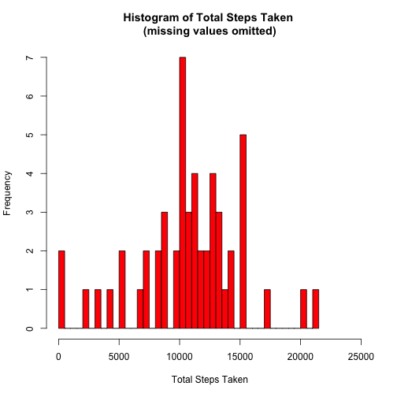
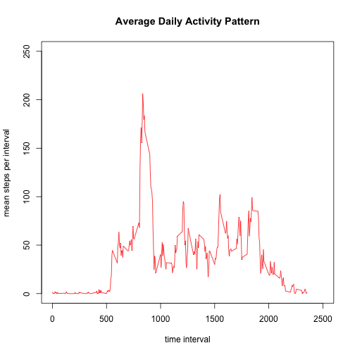
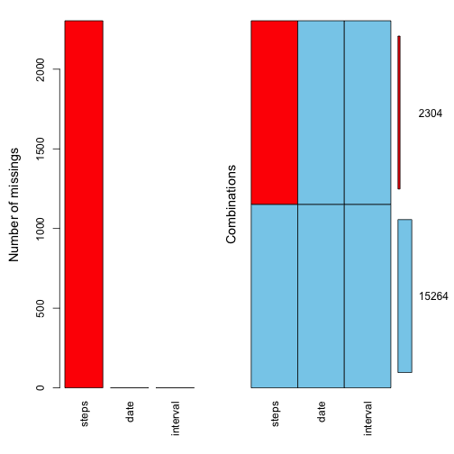
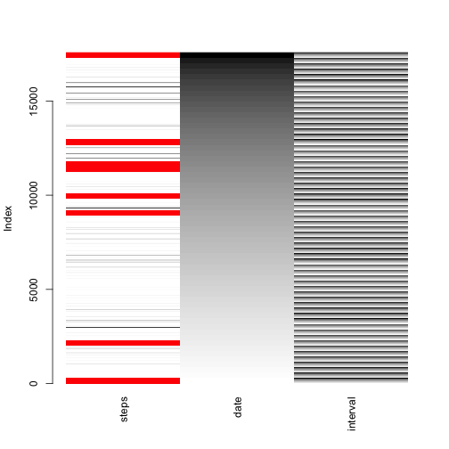
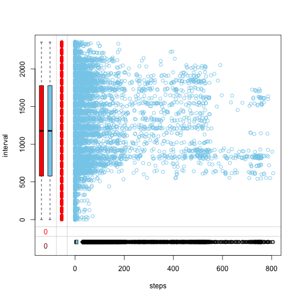
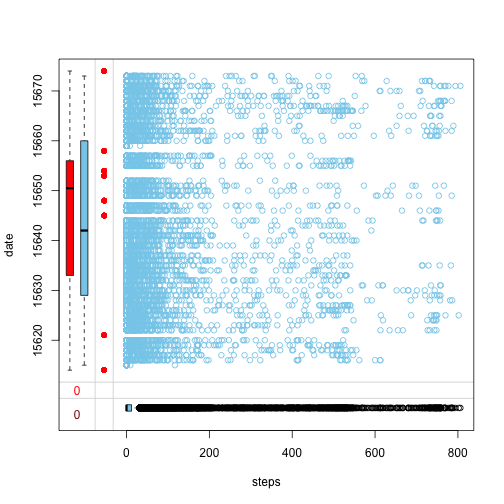
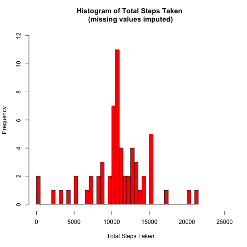
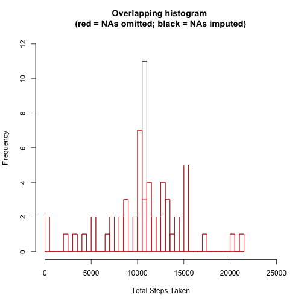
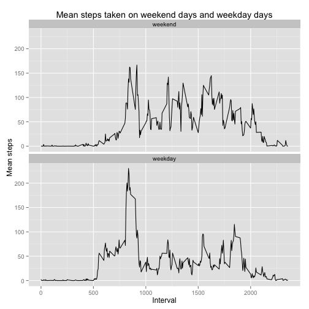

# Coursera Reproducible Research 
## Course project 1

### Loading and preprocessing the data
Note: It is assumed that the repository with all files needed was cloned. However, just to be sure, run a file check. If the files needed are not in the current working directory, the script stops and displays an error message. The script also unzips the raw data file if needed.

```r
if (!file.exists("./activity.zip")) {
	stop("Files not found. Please set working directory to folder with necessary data files.")
}
if (!file.exists("./activity.csv")){
	unzip("./activity.zip")
}
```

Read data file.

```r
repdata <- read.csv("./activity.csv", header = TRUE, colClasses = c("numeric", "Date", "numeric"))
```

### What is mean total number steps taken per day?
Task: Calculate total steps per day, while ignoring missing values. Plot histogram of total steps taken.

```r
repdata.sum <- with(repdata, na.omit(aggregate(steps, by = list(date), FUN = sum)))
names(repdata.sum) <- c("datecollected", "totalsteps")
hist(repdata.sum$totalsteps, breaks = 53, col = "red", xlab = "Total Steps Taken", ylab = "Frequency", main = "Histogram of Total Steps Taken \n(missing values omitted)", xlim = c(0, 25000))
```

 

Task: Calculate mean and median total steps taken per day. Ignore missing values. Report mean and median. 

[Note: Code also sets R options to not using scientific notion.]  

```r
options("scipen" = 100, "digits" = 4)
repdata.mean <- with(repdata.sum, mean(repdata.sum$totalsteps))
repdata.median <- with(repdata.sum, median(repdata.sum$totalsteps))
repdata.mean
```

```
## [1] 10766
```

```r
repdata.median
```

```
## [1] 10765
```

Answer: The mean total steps taken per day is 10766.1887.
The median total steps taken per day is 10765. 

### What is the average daily activity pattern?
Task: Calculate mean steps per 5-min time intervall across all days. Make time series plot. 

```r
repdata.clean <- na.omit(repdata)
repdata.ts <- with(repdata.clean, aggregate(steps, by = list(interval), FUN = mean))
names(repdata.ts) <- c("interval", "meansteps")
with(repdata.ts, plot(meansteps ~ interval, type = "l", col = "red", main = "Average Daily Activity Pattern", xlab = "time interval", ylab = "mean steps per interval", xlim = c(0,2500), ylim = c(0, 250)), echo = TRUE)
```

 

Question: Which 5-minute interval, on average across all the days in the dataset, contains the maximum number of steps? 

```r
repdata.timeseriesmax <- with(repdata.ts, max(meansteps))
repdata.interval <- c()
for (i in 1:nrow(repdata.ts)){
        if (identical(repdata.ts$meansteps[i], repdata.timeseriesmax))
                repdata.interval <- repdata.ts[i,1]
}
repdata.timeseriesmax
```

```
## [1] 206.2
```

```r
repdata.interval
```

```
## [1] 835
```

Answer: Interval 835 contains the maximum average number of steps (i.e., 206.1698) averaged across all days in the data set, while ignoring missing values. 

### Imputing missing values
Task: Calculate and report the total number of missing values in the dataset (i.e. the total number of rows with NAs). 

```r
repdata.missing <- sum(is.na(repdata$steps))
repdata.missing
```

```
## [1] 2304
```

There are 2304 missing values in the data set.

Task: Devise a strategy for filling in all of the missing values in the dataset. Create a new dataset that is equal to the original dataset but with the missing data filled in. 

First, let's explore the pattern of missing values suing the VIM package. The first plot shows that only the steps variable is missing values. The second plot shows how the missing values are distributed in relation to the date and interval variables. The third plot shows that mean steps taken per interval do not differ between those with and without missing values. The forth plot suggests an association between date and missing values. Even though a more sophisticated missing value management approach is preferable (e.g., using the mice package), for simplicity, missing values with be imputed with the mean steps of that interval across all days (probably a valid approach considering plot 3) and saved as a new dataframe called impute.  

```r
library(VIM)
```

```
## Loading required package: colorspace
## Loading required package: grid
## VIM is ready to use. 
##  Since version 4.0.0 the GUI is in its own package VIMGUI.
## 
##           Please use the package to use the new (and old) GUI.
## 
## 
## Attaching package: 'VIM'
## 
## The following object is masked from 'package:datasets':
## 
##     sleep
```

```r
aggr(repdata, prop = FALSE, numbers = TRUE)
```

 

```r
matrixplot(repdata)                             ## Note: There will be 3 warnings. 
```

```
## Warning: 'gamma' is deprecated and has no effect
## Warning: 'gamma' is deprecated and has no effect
## Warning: 'gamma' is deprecated and has no effect
```

 

```r
marginplot(repdata[c("steps", "interval")])
```

 

```r
marginplot(repdata[c("steps", "date")])
```

 

```r
impute <- repdata                               ## Copy original data set for imputation. 
repdata.impute <- with(repdata.clean, aggregate(steps, by = list(interval), FUN = mean))                                          ## Calculate mean per interval across dates. 
names(repdata.impute) <- c("interval", "meansteps")
toimpute <- c()
for (i in 1:nrow(impute)){
        for (j in 1:nrow(repdata.impute)){
                if (identical(impute$interval[i], repdata.impute$interval[j])) {
                        toimpute <- repdata.impute$meansteps[j]
                }
        }
        if (is.na(impute$steps[i])){
                impute$steps[i] <- toimpute
        }
}
```

Task: Make a histogram of the total number of steps taken each day.

```r
impute.sum <- with(impute, aggregate(steps, by = list(date), FUN = sum))
names(impute.sum) <- c("datecollected", "totalsteps")
hist(impute.sum$totalsteps, breaks = 61, col = "red", xlab = "Total Steps Taken", ylab = "Frequency", main = "Histogram of Total Steps Taken \n(missing values imputed)", xlim = c(0, 25000), ylim = c(0,12))
```

 

Task: Calculate and report the mean and median total number of steps taken per day.

```r
impute.mean <- with(impute.sum, mean(impute.sum$totalsteps))
impute.median <- with(impute.sum, median(impute.sum$totalsteps))
impute.mean
```

```
## [1] 10766
```

```r
impute.median
```

```
## [1] 10766
```

Answer: Using the mean imputed data, the mean total steps taken is 10766.1887, and the median total steps taken is 10766.1887.

Task: Do these values differ from the estimates from the first part of the assignment? 

```r
mean.diff <- identical(repdata.mean, impute.mean)
median.diff <- identical(repdata.median, impute.median)
mean.diff
```

```
## [1] TRUE
```

```r
median.diff
```

```
## [1] FALSE
```

Answer: There is a difference between the mean total steps taken with missing values omitted and mean total steps taken with missing values imputed: TRUE. There is a difference between median total steps taken with missing values omitted and median total steps taken with missing values imputed: FALSE. 

Task: What is the impact of imputing missing data on the estimates of the total daily number of steps?

Plot total steps with missing values omitted and imputed respectively in an overlapping histogram. Compare count parameters of histogram. 

```r
## Histogram of total steps, missing values omitted.
hist.omit <- hist(impute.sum$totalsteps, breaks = 61, col = rgb(0.8,0.8,0.8,0.0), xlab = "Total Steps Taken", ylab = "Frequency", xlim = c(0, 25000), ylim = c(0,12), border = "black", main = "Overlapping histogram \n(red = NAs omitted; black = NAs imputed)")
## Histogram of total steps, missing values imputed.
hist.impute <- hist(repdata.sum$totalsteps, breaks = 53, col = rgb(0.8,0.8,0.8,0.0), xlim = c(0, 25000), ylim = c(0,12), border = "red", add = TRUE)
```

 

```r
## Are counts identical?
identical(hist.omit$count, hist.impute$count)
```

```
## [1] FALSE
```

```r
## Combine counts of the two data sets, print for comparison. 
histcompare <- as.data.frame(cbind(hist.omit$count, hist.impute$count))
names(histcompare) <- c("omit.count", "impute.count")
histcompare
```

```
##    omit.count impute.count
## 1           2            2
## 2           0            0
## 3           0            0
## 4           0            0
## 5           1            1
## 6           0            0
## 7           1            1
## 8           0            0
## 9           1            1
## 10          0            0
## 11          2            2
## 12          0            0
## 13          0            0
## 14          1            1
## 15          2            2
## 16          0            0
## 17          2            2
## 18          3            3
## 19          0            0
## 20          2            2
## 21          7            7
## 22         11            3
## 23          4            4
## 24          2            2
## 25          2            2
## 26          4            4
## 27          3            3
## 28          1            1
## 29          2            2
## 30          0            0
## 31          5            5
## 32          0            0
## 33          0            0
## 34          0            0
## 35          1            1
## 36          0            0
## 37          0            0
## 38          0            0
## 39          0            0
## 40          0            0
## 41          1            1
## 42          0            0
## 43          1            1
```

Answer: As seen in the Overlaying Histogram and the histcompare dataframe respectively, imputation infuences counts in the 10,500 break. 

### Are there differences in activity patterns between weekdays and weekends?
Task: Create a new factor variable in the dataset with two levels – “weekday” and “weekend” indicating whether a given date is a weekday or weekend day.

```r
impute$weekday <- weekdays(impute$date)
for (i in 1:nrow(impute)){
        ifelse(impute$weekday[i] == "Saturday" | impute$weekday[i] == "Sunday", impute$weekend[i] <- "weekend", impute$weekend[i] <- "weekday")
        }
impute$weekend <- factor(impute$weekend, levels = c("weekend", "weekday"))
```

Task: Make a panel plot containing a time series plot (i.e. type = "l") of the 5-minute interval (x-axis) and the average number of steps taken, averaged across all weekday days or weekend days (y-axis).

```r
impute.week.ts <- with(impute, aggregate(steps, by = list(interval, weekend), FUN = mean))
names(impute.week.ts) <- c("interval", "weekend", "meansteps")
library(ggplot2)
plot <- ggplot(data = impute.week.ts, aes(x = interval, y = meansteps)) + geom_line() 
plot + facet_wrap(~weekend, nrow = 2) + labs(title = "Mean steps taken on weekend days and weekday days", x = "Interval", y = "Mean steps")
```

 
